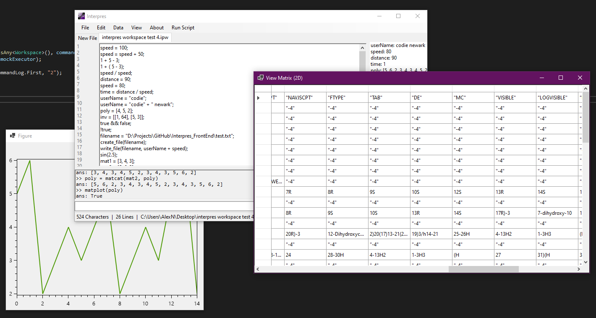

#Interpres

Interpres is a MatLab style interpreter system I created while studying Advanced Programming at the University of East Anglia.
This repository contains the front-end code. The actual interpreting code can be found in the Interpres_Interpreter repository.

